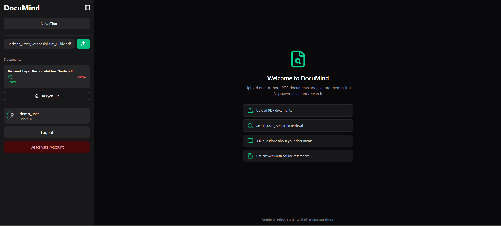

# DocuMind

> **Production-Ready Multi-User Retrieval-Augmented Generation (RAG) AI
> Assistant**

DocuMind is a full-stack Retrieval-Augmented Generation (RAG)
application that allows authenticated users to upload PDF documents,
index them into a vector database, and ask AI-powered questions grounded
in their own documents.

## Highlights

-   Multi-user JWT authentication
-   PDF ingestion pipeline
-   Semantic retrieval with Qdrant Cloud
-   Query expansion + hybrid reranking + MMR
-   OpenRouter LLM integration
-   Conversation history
-   Soft delete & recycle bin for documents and conversations
-   Health check endpoint
-   Request logging middleware
-   Dockerized backend
-   React + TypeScript frontend

------------------------------------------------------------------------

# Architecture

``` text
User
 │
 ▼
React Frontend
 │
 ▼
FastAPI Backend
 │
 ├── Authentication (JWT)
 ├── PDF Upload
 ├── Text Extraction
 ├── Text Cleaning
 ├── Chunking
 ├── Embedding Generation
 ├── Qdrant Storage
 │
 ▼
Question → Query Expansion → Semantic Retrieval
        → Hybrid Reranking → MMR → LLM → Response
```

# Tech Stack

## Backend

-   FastAPI
-   SQLAlchemy
-   Alembic
-   PostgreSQL
-   JWT

## Frontend

-   React
-   TypeScript
-   Vite
-   Tailwind CSS
-   shadcn/ui
-   Lucide Icons

## AI

-   sentence-transformers (all-MiniLM-L6-v2)
-   Qdrant Cloud
-   OpenRouter

# Features

  Feature                Status
  ---------------------- --------
  Authentication         ✅
  PDF Upload             ✅
  Semantic Search        ✅
  Hybrid Reranking       ✅
  Conversation History   ✅
  Soft Delete            ✅
  Recycle Bin            ✅
  Restore                ✅
  Health Check           ✅
  Logging Middleware     ✅

# Installation

``` bash
pip install -r requirements.txt
alembic upgrade head
uvicorn app.main:app --reload
```

``` bash
cd frontend
npm install
npm run dev
```

# Environment Variables

``` env
DATABASE_URL=
QDRANT_URL=
QDRANT_API_KEY=
QDRANT_COLLECTION=
OPENROUTER_API_KEY=
SECRET_KEY=
ALGORITHM=HS256
ACCESS_TOKEN_EXPIRE_MINUTES=30
```

# API

  Method   Endpoint
  -------- -------------------------
  POST     /register
  POST     /login
  POST     /upload
  POST     /ask
  GET      /documents
  GET      /documents/deleted
  POST     /documents/{id}/restore
  DELETE   /documents/{id}
  GET      /health

# Engineering Learnings

-   Retrieval quality matters more than model size.
-   Chunking quality directly impacts retrieval.
-   Metadata filtering is essential for multi-user systems.
-   Modular architecture simplifies maintenance.

## Screenshots

### Login


### Dashboard


### AI Chat


### Recycle Bin


### Mobile View


# Future Improvements

## Authentication & Security

- Email verification during registration
- Forgot password / password reset via email
- OAuth 2.0 authentication (Google, GitHub)
- Refresh token implementation
- Secure HTTP-only cookie authentication
- HTTPS enforcement
- Rate limiting and request throttling
- Role-based access control (RBAC)
- Secure file validation and upload restrictions
- Audit logging for sensitive operations

---

## AI & Retrieval

- Hybrid BM25 + Vector Search
- Parent-Child Retrieval
- Semantic Chunking
- Contextual Compression
- Metadata-aware Ranking
- Cross-Encoder Reranking
- Streaming AI Responses
- Support for multiple LLM providers
- Conversation memory optimization
- Citation highlighting within answers

---

## Backend & Infrastructure

- Background workers using Celery/RQ
- Redis caching layer
- Asynchronous document ingestion
- Object storage integration (AWS S3 / MinIO)
- Container orchestration with Kubernetes
- CI/CD pipeline with GitHub Actions
- Prometheus & Grafana monitoring
- Distributed tracing with OpenTelemetry
- Database query optimization
- Automated backup and recovery strategy

---

## User Experience

- Fully responsive mobile interface
- Drag-and-drop document uploads
- Upload progress indicators
- Real-time document processing status
- Advanced document filtering and search
- Folder / Workspace organization
- Dark / Light theme support
- Document preview before querying
- Bulk upload support
- Keyboard shortcuts

---

## Document Management

- Support for DOCX, TXT, Markdown and HTML
- OCR support for scanned PDFs
- Version history for uploaded documents
- Permanent delete with retention policy
- Document tagging and categorization
- Batch document operations

---

## Testing & Quality

- Unit tests
- Integration tests
- End-to-end testing
- Load and performance testing
- Security testing
- API contract testing
- Automated code quality checks


# Engineering Goals

This project was built to simulate a production-ready Retrieval-Augmented Generation (RAG) system rather than a simple AI chatbot. The primary focus was on modular backend architecture, secure multi-user document isolation, scalable retrieval pipelines, maintainable code organization, and a modern full-stack user experience.

The roadmap above reflects production features that would typically be added as the application evolves toward enterprise readiness.